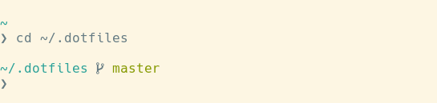

# Dotfiles

My collection of dotfiles is stored in a bare Git reposity in my home directory.
An alias is created to manage the dotfiles: `dotfiles`.
Basic setup:

```
git init --bare $HOME/.dotfiles
alias dotfiles='/usr/bin/git --git-dir=$HOME/.dotfiles --work-tree=$HOME'
dotfiles config --local status.showUntrackedFiles no
```

## Terminal

I run urxvt-unicode with [oh-my-zsh](https://github.com/robbyrussell/oh-my-zsh)
and a customized prompt.



## Package Tracking

I keep track of the packages that I have installed on my system using
`pacman -Qqettn` (native) and `pacman -Qqettm` (foreign) in the
[Packages/](./Packages/) directory.
The `update.sh` script automatically updates the package lists.
